# Panorama Stitching

Panorama Stitching(python) - Assignment4: CS698U: Topics in Computer Vision

## Direct Linear Transform

Using Four Point Correspondences between original and transformed images

### Sample Results

Original | Transformed | Post-Processing(Closing) |
-------- | ----------- | ------------------------ |
 | 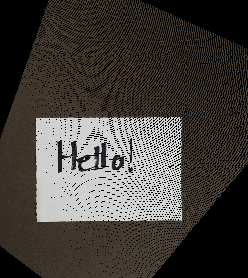 | 
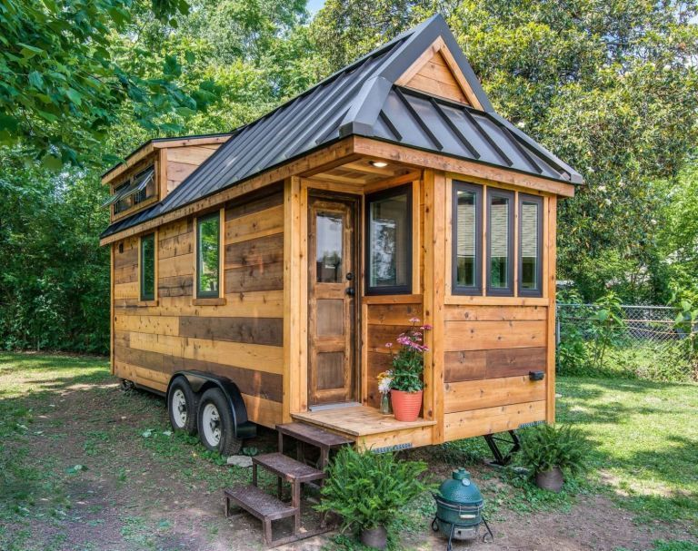 |  | 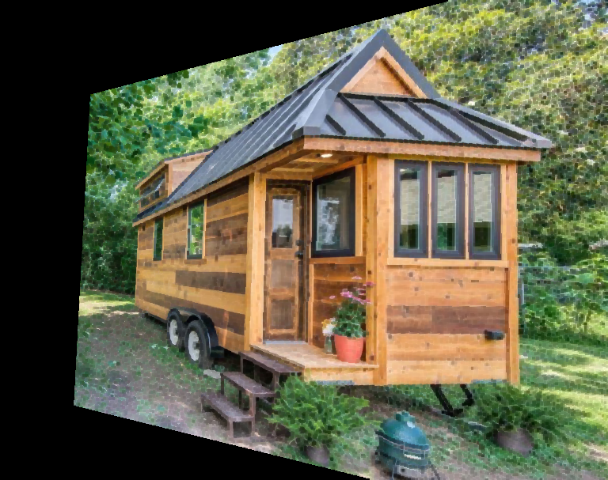
 | 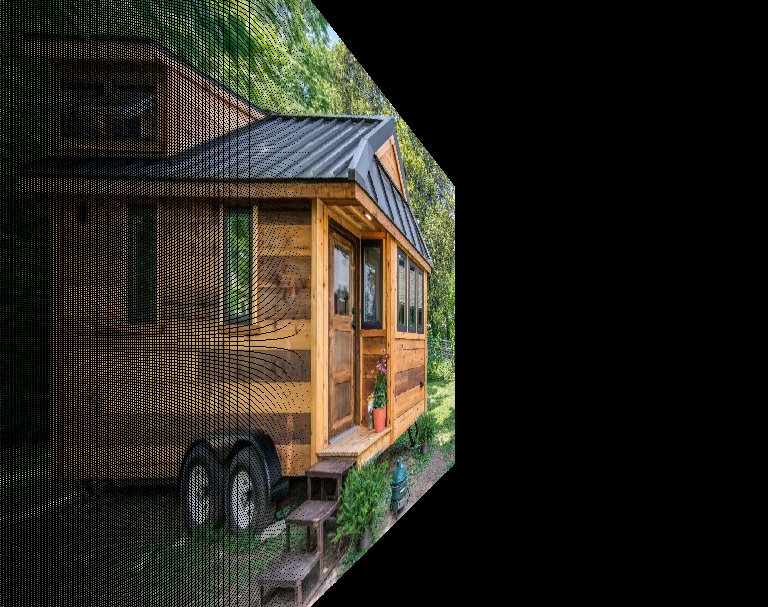 | 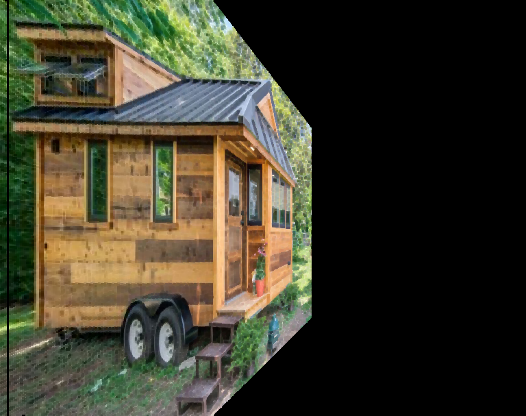
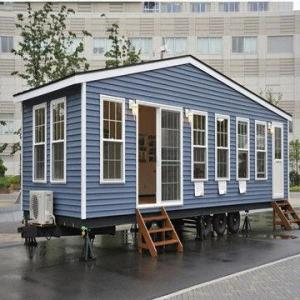 |  | 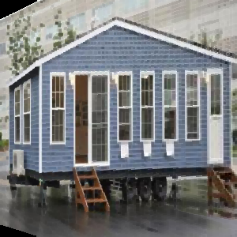
 |  | 
 |  | 

## Panaroma Sample Results

Left | Right | Result |
---- | ----- | ------ |
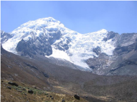 | 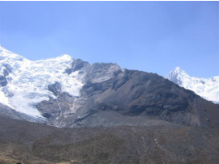 | 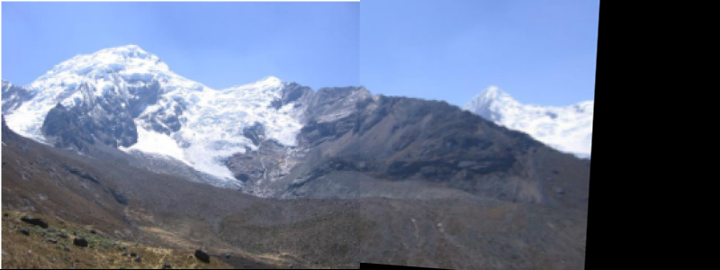
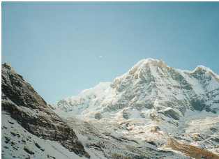 | 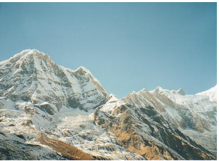 | 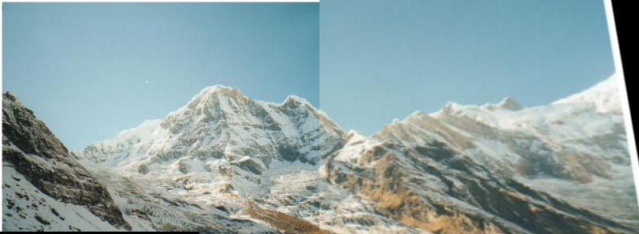
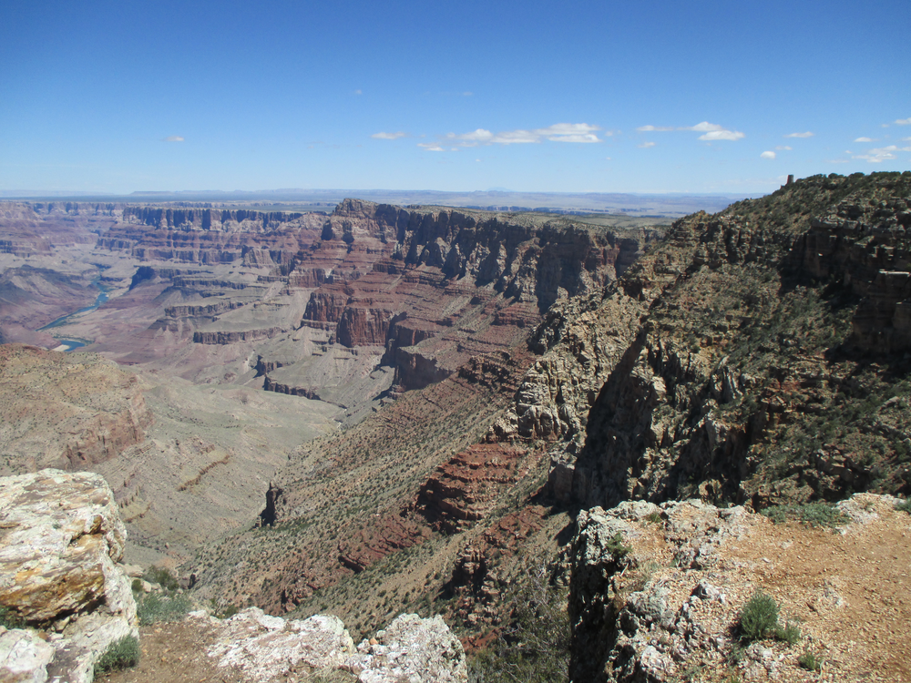 | 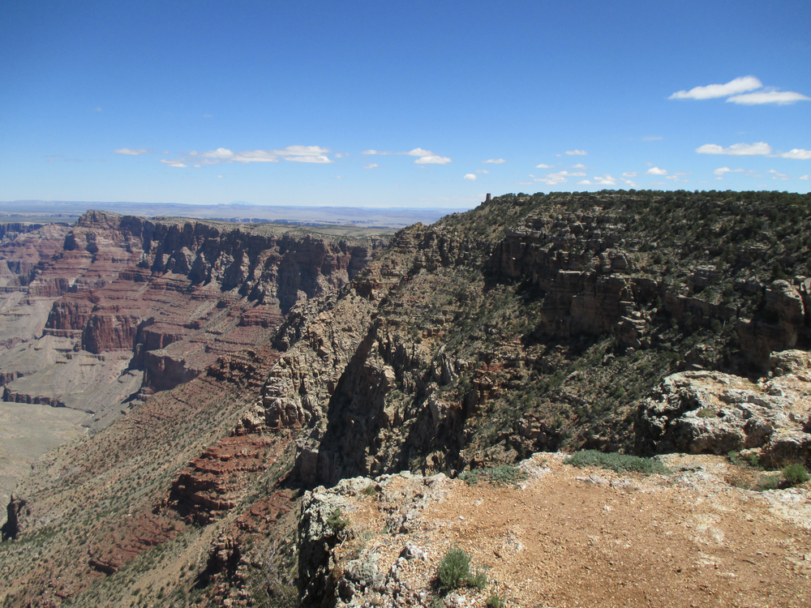 | 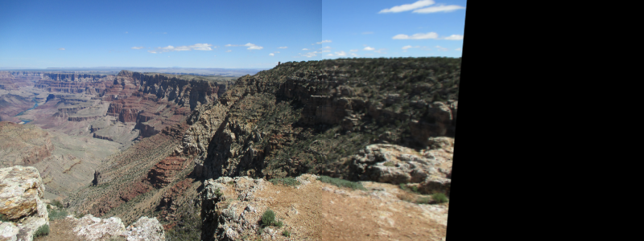
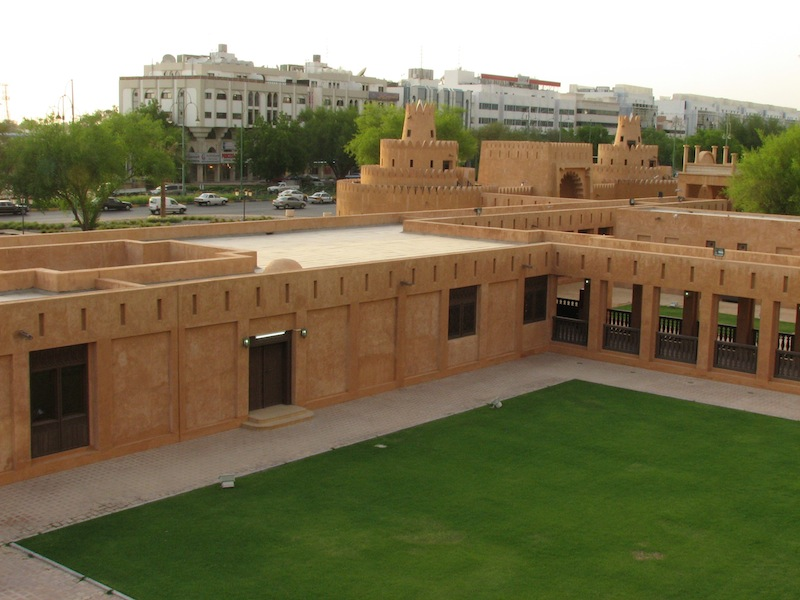 | 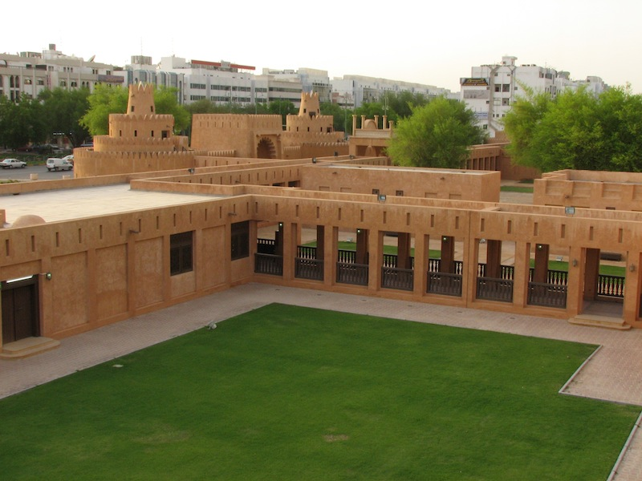 | 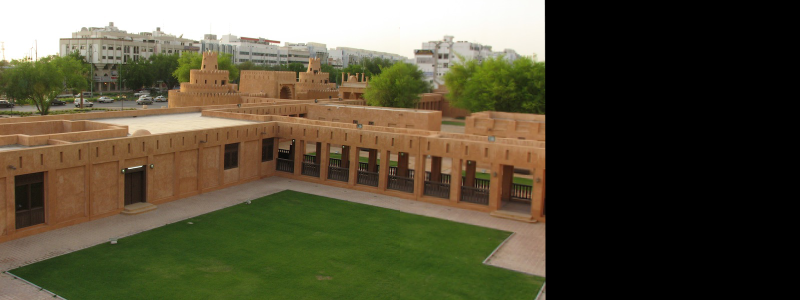
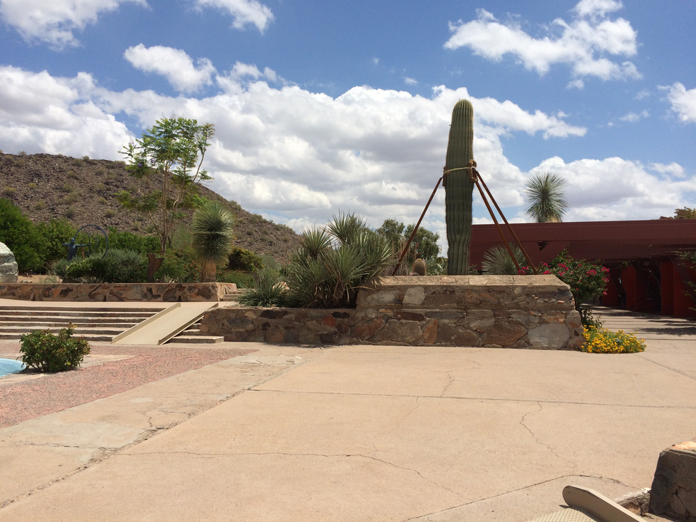 | 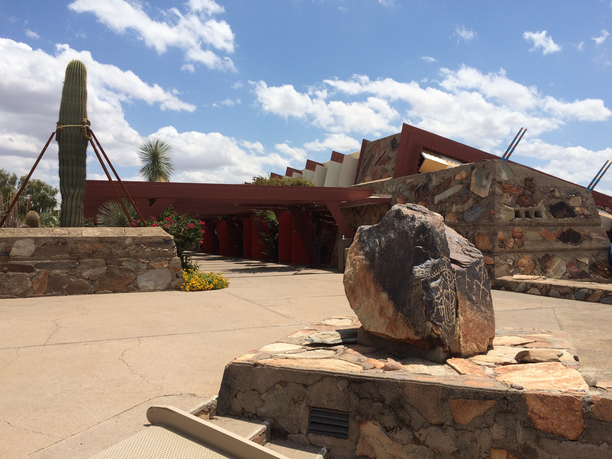 | 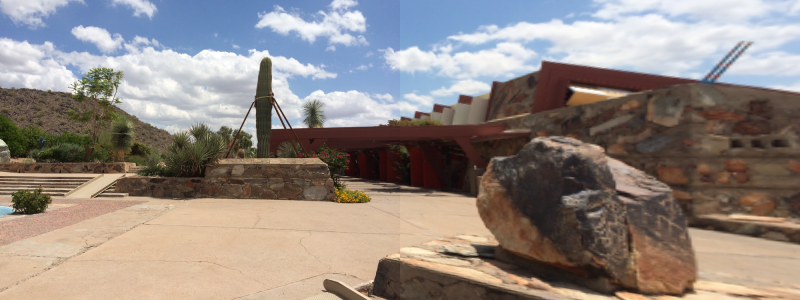

* Images and Code for _matchPoints_ taken from :[PyImageSearch Panaroma Stitching](http://www.pyimagesearch.com/2016/01/11/opencv-panorama-stitching/)
by _Adrian Rosebrock_
